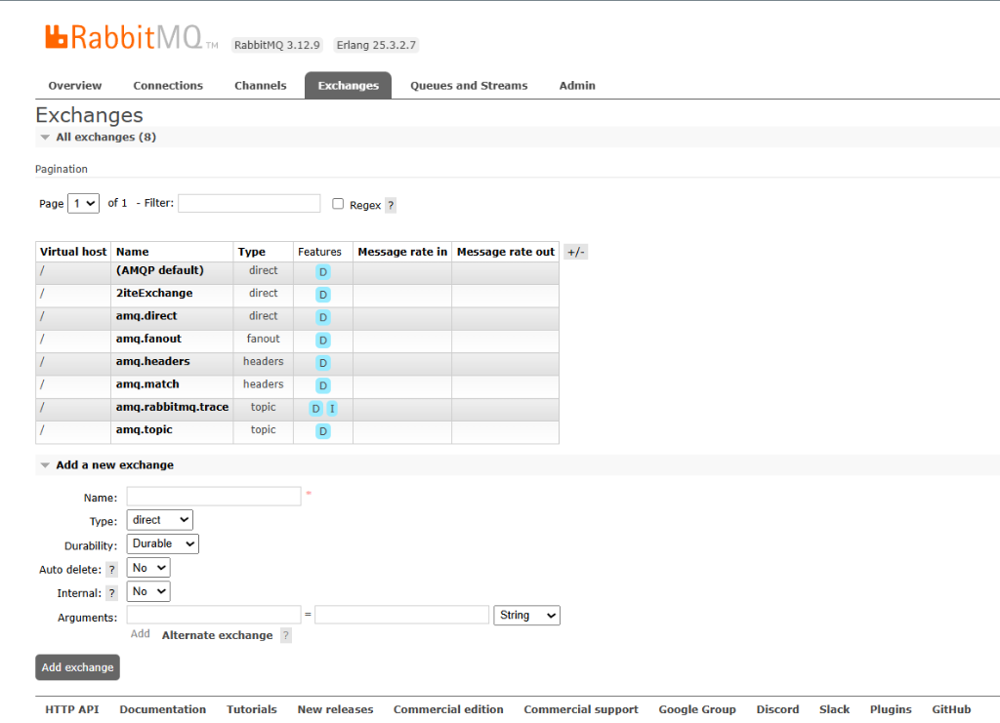
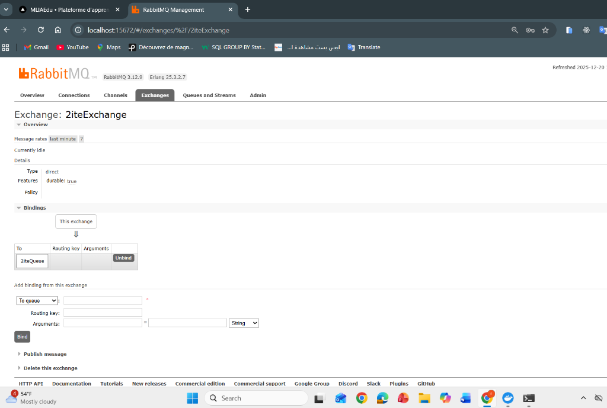
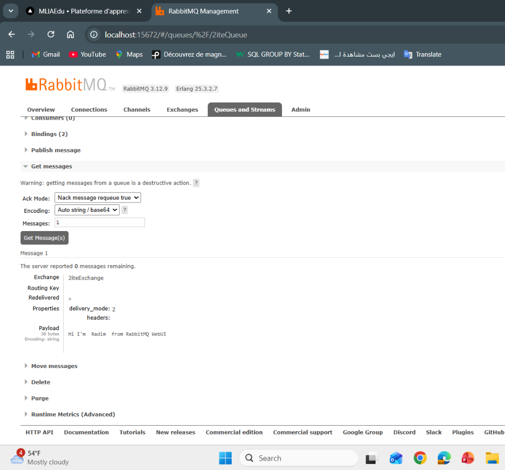
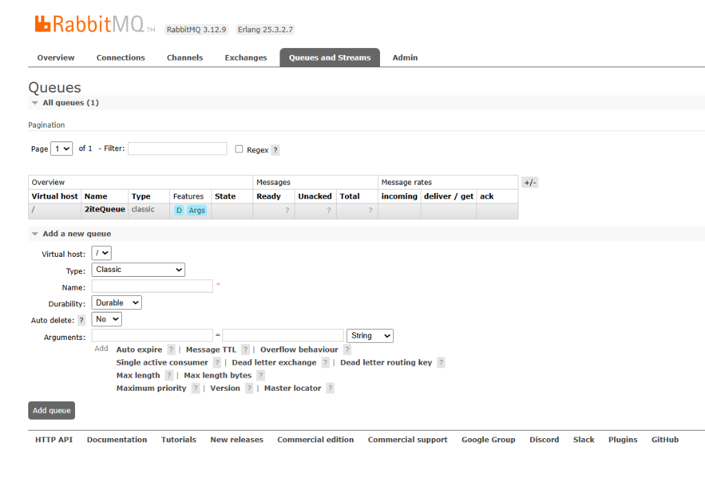
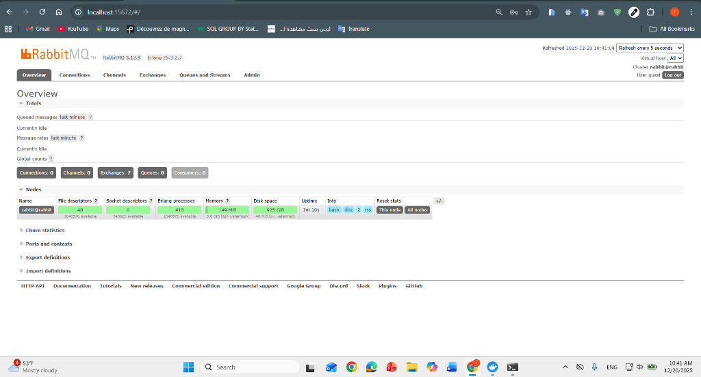

"# TP 29 - RabbitMQ Management avec Docker + Exchange/Queue/Binding + Publish/Consume

## 📋 Description

Ce projet démontre l'utilisation de RabbitMQ avec Docker, incluant la configuration des exchanges, queues, bindings et la publication/consommation de messages via l'interface de gestion RabbitMQ.

## 🚀 Technologies Utilisées

- **RabbitMQ** - Message broker
- **Docker** - Containerisation
- **RabbitMQ Management UI** - Interface de gestion web

## 📸 Screenshots

### 1. RabbitMQ Exchanges Overview

Cette capture d'écran montre la liste des exchanges configurés dans RabbitMQ :
- **(AMQP default)** - Exchange par défaut de type `direct`
- **2iteExchange** - Exchange de type `direct` avec durabilité activée
- **amq.direct** - Exchange direct système
- **amq.fanout** - Exchange fanout système
- **amq.headers** - Exchange headers système
- **amq.match** - Exchange match système
- **amq.rabbitmq.trace** - Exchange de type `topic` pour le tracing
- **amq.topic** - Exchange topic système

### 2. Exchange Bindings Configuration

Cette page affiche les détails de l'exchange **2iteExchange** :
- **Type** : `direct`
- **Features** : `durable: true`
- **Bindings** : Montre la liaison entre l'exchange et la queue `2iteQueue` avec une routing key configurée

### 3. Queue Messages

Cette capture montre la page de gestion des messages de la queue **2iteQueue** :
- **Get messages** : Interface pour récupérer et consommer les messages
- **Message details** : Affiche un message reçu avec :
  - Exchange : `2iteExchange`
  - Routing key : `-`
  - Redelivered : `-`
  - Properties : `delivery_mode: 2`, `headers:`
  - Payload : `"Hi I'm idrissi  from RabbitMQ WebUI"`

### 4. Queues Overview

Cette page liste toutes les queues configurées :
- **2iteQueue** - Queue de type `classic` avec :
  - Features : `D` (Durable), `Args` (Arguments configurés)
  - State : `idle` (en attente)
  - Messages : Statistiques des messages ready, unacked, et total

### 5. RabbitMQ Overview Dashboard

Le tableau de bord principal de RabbitMQ affichant :
- **Totals** : Statistiques globales
  - Queued messages last minute
  - Message rates last minute
  - Currently idle
  - Global counts
- **Nodes** : Informations sur le nœud RabbitMQ
  - Name : `rabbit@idrissi`
  - File descriptors : `32/32 available`
  - Socket descriptors : `0/29 available`
  - Erlang processes : `242/262 available`
  - Disk space : `5.02 GB high-watermark`
  - Memory : `98.07 MB / 6.62 GB`
  - Uptime : `1m 30s`
- **Connections** : `0`
- **Channels** : `0`
- **Exchanges** : `7`
- **Queues** : `0`
- **Consumers** : `0`"# TP-29-RabbitMQ-Management-avec-Docker" 
